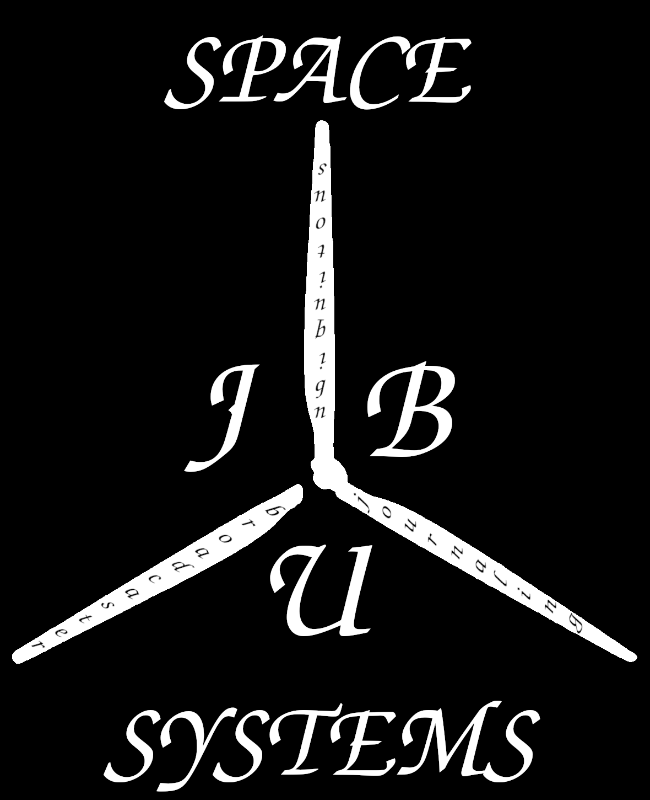
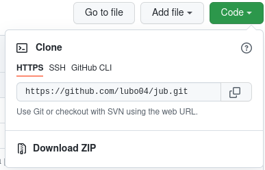

# Space Jub (задължително)

Устройство за отчитане на концентрацията на различни газове във въздуха, предназначено за херметично запечатани извънземни станции, разработено за HackTUES 8. Информацията приета от датчиците се представя на уебсайт.

## Презентация

[Линк към презентацията](project_documentation_files/Prezentaciq.pptx).

## Как да си сваля и използвам проекта?

### Инструкции за сваляне

1) Проектът може да се свали като ZIP файл от GitHub или през командния ред с командата `git clone https://github.com/lubo04/jub.git`

### Инструкции за инсталация

1) Инсталиране на сървърен стак, включващ Apache (или друг уеб сървър), PHP и MySQL, и правилното им конфигуриране с цел съвместна работа.
2) Инсталиране на интерпретатор за езика Python, както и библиотеката pySerial.
3) Копиране на съдържанието на директория `/web/` на проекта в коренната уеб директория, конфигурирана за уеб сървъра.
4) Сглобяване на устройството по схемата показана [тук](readme_pics/schematic_image.png). Bluetooth модула да бъде свързан едва след като бъде изпълнена стъпка №6. Оригиналните файлове за системата за автоматизирано проектиране в електрониката KiCAD могат да бъдат намерени [тук (библиотека със символи)](project_documentation_files/60_metra.kicad_sym) и [тук (файл на схематиката)](project_documentation_files/space_jub_scheme.kicad_sch).
5) Последователно качване и изпълняване за означеното време на програмите за калибрация, поставени в директорията `/arduino/`.
6) Качване на основната програма на микроконтролера (`/arduino/arduino_code.ino`).
7) Свързване на Bluetooth модул HC-06.

### Инструкции за стартиране на проекта

1) Захранване на сглобеното устройство.
2) Свързване на компютъра с устройството посредством Bluetooth.
3) Конфигуриране на правилното име на порта в скрипта `readcom.py` в уеб директорията.
4) Изпълняване на скрипта `readcom.py` на заден план.
5) Отваряне на адрес 127.0.0.1 в уеб браузър на компютъра, на който се изпълняват програмите.

## Използвани технологии

* [Apache HTTP Server](https://httpd.apache.org/) - Многоплатформен уеб сървър.
* [PHP](https://www.php.net/) - Скриптов език за сървърната страна.
* [MySQL](https://www.mysql.com/) - SQL система за управление на бази данни.
* [HTML](https://html.spec.whatwg.org/) - Маркиращ език за описание и дизайн на уеб страници.
* [CSS](https://www.w3.org/TR/CSS/#css) - Език за описание на представянето на HTML страници.
* [Javascript](http://www.ecma-international.org/publications-and-standards/standards/ecma-262/) - Интерпретируем скриптов език за уеб програмиране.
* [SVG](https://www.w3.org/Graphics/SVG/) - Файлов формат за описание на векторни изображения.
* [GIF](http://www.w3.org/Graphics/GIF/spec-gif89a.txt) - Файлов формат за съхранение на растерни изображения, позволяващ и те да бъдат анимирани.
* [Python](https://www.python.org/) - Интерпретируем скриптов език.
* [Bluetooth](https://www.bluetooth.com/) - Късообхватна безжична технология за PAN (Personal Area Networks), работеща в UHF (Ultra High Frequency) обхвата.
* [C++](https://isocpp.org/) - Компилиран език за програмиране, често използван за програмиране на микроконтролерни системи Arduino.
* [Arduino](https://www.arduino.cc/) - Готови микроконтролерни платки с процесори на Atmel, както и интегрираната среда за разработка, която позволява програмирането им.

## Информация за авторите на проекта

* **Адриан Стоев** - хардуерист, връзки с обществеността - [Adito127](https://github.com/Adito127)
* **Борис Кисьов** - програмист, хардуерист, администратор - [boris7645](https://github.com/boris7645)
* **Иво Иванов** - програмист, хазяин - [Ivoivanov004](https://github.com/Ivoivanov004)
* **Любомир Начев** - програмист на микроконтролера, хардуерист - [lubo04](https://github.com/lubo04)
* **Ясен Спасов** - програмист, администратор - [amendip](https://github.com/amendip)
